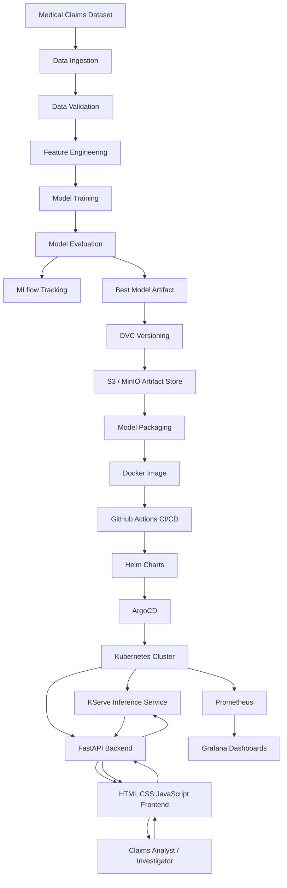

# High-Level System Design – Medical Claim Fraud Detection Platform (ML + MLOps + KServe)

> **Goal:** Design and deploy an end-to-end Medical Claim Fraud Detection Platform using Machine Learning, MLOps, Kubernetes, KServe, GitOps, and Observability.

---

# 1. System Overview

The platform ingests historical medical claim data, performs preprocessing and feature engineering, trains fraud detection models, tracks experiments using MLflow, versions datasets and models using DVC, and deploys the best model using KServe on Kubernetes.

A FastAPI backend acts as an API Gateway between the frontend and KServe inference service. GitHub Actions automates CI/CD while ArgoCD continuously synchronizes deployments using GitOps principles. Prometheus and Grafana provide monitoring and observability.

---

# 2. High-Level Architecture



---

# 3. Core Components

| Layer | Component | Responsibility |
|---------|-----------|---------------|
| Data Layer | data_ingestion.py | Load healthcare claim records |
| Data Layer | preprocessing.py | Clean and transform data |
| Data Layer | feature_engineering.py | Create fraud-related features |
| Data Quality | Evidently AI | Data validation and drift detection |
| Model Training | train.py | Train ML models |
| Model Evaluation | evaluate.py | Compare model performance |
| Experiment Tracking | MLflow | Track metrics, parameters, artifacts |
| Version Control | DVC + S3/MinIO | Version datasets and models |
| Model Serving | KServe | Production-grade inference serving |
| Backend | FastAPI | API gateway and request routing |
| Frontend | HTML/CSS/JS | User interface |
| Containerization | Docker | Package application components |
| Deployment | Helm | Kubernetes resource management |
| GitOps | ArgoCD | Continuous deployment |
| Monitoring | Prometheus | Metrics collection |
| Monitoring | Grafana | Dashboards and alerting |

---

# 4. Machine Learning Workflow

## Step 1: Data Collection

Medical claim records include:

- Claim Amount
- Claim Type
- Procedure Codes
- Diagnosis Codes
- Provider Information
- Patient Demographics
- Historical Fraud Labels

---

## Step 2: Data Processing

- Missing value handling
- Outlier detection
- Feature scaling
- Categorical encoding
- Data validation

---

## Step 3: Feature Engineering

Examples:

- Claim Amount Deviation
- Provider Fraud History
- Average Claim Cost
- Claim Frequency
- Duplicate Claim Indicators
- High-Risk Procedure Score

---

## Step 4: Model Training

Supported models:

- Logistic Regression
- Random Forest
- XGBoost
- LightGBM
- CatBoost

---

## Step 5: Model Evaluation

Metrics:

- Accuracy
- Precision
- Recall
- F1 Score
- ROC-AUC
- PR-AUC

Fraud detection prioritizes:

- High Recall
- High Precision
- Low False Negatives

---

# 5. End-to-End Deployment Flow

```text
Developer Push Code
        │
        ▼
GitHub Repository
        │
        ▼
GitHub Actions CI Pipeline
        │
        ├── Unit Testing
        ├── Data Validation
        ├── Model Training
        ├── MLflow Logging
        ├── DVC Push
        ├── Docker Build
        └── Docker Push
        │
        ▼
Helm Chart Update
        │
        ▼
ArgoCD Sync
        │
        ▼
Kubernetes Cluster
        │
        ├── FastAPI Backend
        ├── KServe Model Server
        ├── Prometheus
        └── Grafana
```

---

# 6. Real-Time Prediction Flow

```text
User
 │
 ▼
Frontend
 │
 ▼
FastAPI Backend
 │
 ▼
KServe Endpoint
 │
 ▼
Fraud Detection Model
 │
 ▼
Prediction Response
 │
 ▼
Frontend Dashboard
```

### Example Response

```json
{
  "claim_id": "CLM-10045",
  "fraud_probability": 0.93,
  "risk_level": "HIGH",
  "prediction": "FRAUD"
}
```

---

# 7. Security Architecture

## Secrets Management

- GitHub Secrets
- Kubernetes Secrets
- AWS Secrets Manager (Optional)

### Examples

- AWS_ACCESS_KEY_ID
- AWS_SECRET_ACCESS_KEY
- DOCKER_USERNAME
- DOCKER_PASSWORD
- MLFLOW_TRACKING_URI

---

## Network Security

- TLS/HTTPS
- NGINX Ingress Controller
- Kubernetes RBAC
- Network Policies

---

## Storage Security

- Encrypted S3 Bucket
- Least Privilege IAM Policies
- Versioned Model Artifacts

---

# 8. Observability & Monitoring

## Infrastructure Monitoring

Prometheus collects:

- CPU Usage
- Memory Usage
- Disk Usage
- Pod Health
- Network Metrics

---

## Application Monitoring

FastAPI metrics:

- Request Count
- Response Time
- Error Rate
- Throughput

---

## ML Monitoring

Evidently AI monitors:

- Data Drift
- Concept Drift
- Feature Distribution Changes
- Prediction Quality

---

# 9. Kubernetes Components

```text
medical-claim-fraud-detection
│
├── Namespace
├── FastAPI Deployment
├── FastAPI Service
├── KServe InferenceService
├── Ingress Controller
├── Prometheus
├── Grafana
├── ConfigMaps
├── Secrets
└── Network Policies
```

---

# 10. Technology Stack

| Category | Technology |
|-----------|------------|
| Frontend | HTML, CSS, JavaScript |
| Backend | FastAPI |
| ML Framework | Scikit-Learn, XGBoost |
| Experiment Tracking | MLflow |
| Data Versioning | DVC |
| Artifact Storage | AWS S3 / MinIO |
| Containerization | Docker |
| Orchestration | Kubernetes |
| Model Serving | KServe |
| GitOps | ArgoCD |
| CI/CD | GitHub Actions |
| Monitoring | Prometheus, Grafana |
| Drift Detection | Evidently AI |
| Package Manager | Helm |
| Language | Python |

---

# 11. Production Benefits

- Real-Time Fraud Detection
- Scalable Kubernetes Deployment
- GitOps-Based Continuous Delivery
- Automated Model Retraining Pipeline
- Model Versioning & Reproducibility
- Drift Detection & Monitoring
- High Availability Inference Service
- Enterprise-Grade Security
- Resume-Worthy End-to-End MLOps Project
- Demonstrates ML, DevOps, MLOps, Kubernetes, KServe, GitHub Actions, ArgoCD, and Observability Skills
