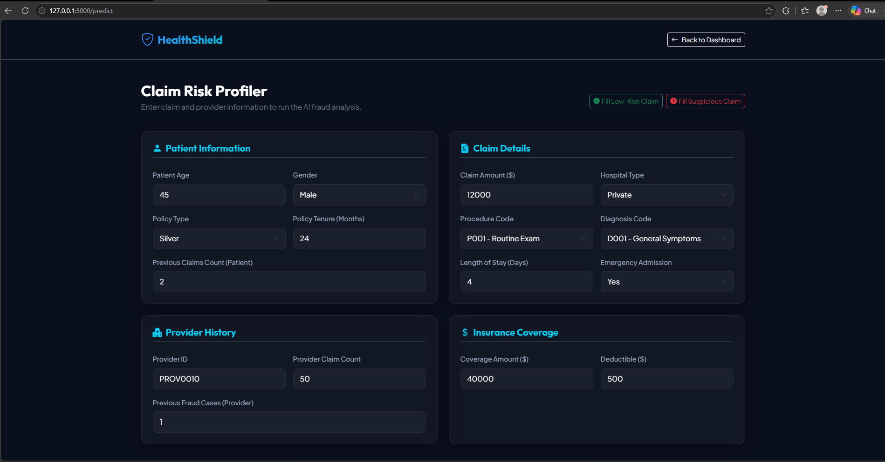
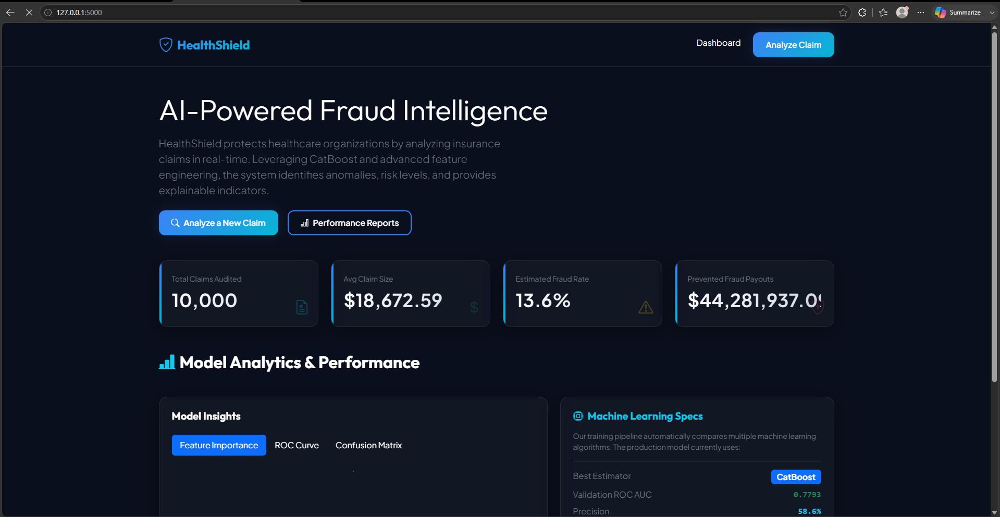

<div align="center">

# 🛡️ HealthShield — Medical Claim Fraud Detection System

**An end-to-end Machine Learning web application that predicts whether healthcare insurance claims are fraudulent or legitimate.**


*Evaluate patient details, provider statistics, clinical codes, and financial inputs to calculate fraud probability with explainable risk indicators.*

---

</div>

## 📋 Table of Contents

- [Problem Statement](#-problem-statement)
- [Business Use Cases](#-business-use-cases)
- [Key Features](#-key-features)
- [Tech Stack](#-tech-stack)
- [Architecture & ML Pipeline](#-architecture--ml-pipeline)
- [Project Structure](#-project-structure)
- [Getting Started](#-getting-started)
- [Model Performance](#-model-performance)
- [Feature Engineering](#-feature-engineering)
- [API Reference](#-api-reference)
- [Screenshots](#-screenshots)
- [Contributing](#-contributing)
- [License](#-license)
- [Acknowledgements](#-acknowledgements)

---

## 🎯 Problem Statement

> Healthcare insurance fraud is a **$300+ billion problem** globally, with the National Health Care Anti-Fraud Association (NHCAA) estimating that **3–10% of total healthcare spending** is lost to fraud every year.

Traditional claim auditing relies on **manual reviews**, which are:
- ❌ Slow and resource-intensive
- ❌ Inconsistent across auditors
- ❌ Unable to detect complex multi-variable fraud patterns
- ❌ Reactive rather than preventive

**HealthShield** solves this by applying machine learning to **proactively detect, score, and explain** potentially fraudulent claims before payouts are processed.

---

## 💼 Business Use Cases

| # | Use Case | How HealthShield Solves It |
|---|----------|---------------------------|
| 1 | **Revenue Loss Prevention** | Flags claims where amounts exceed coverage limits or show extreme claim-to-coverage ratios, preventing millions in fraudulent payouts. |
| 2 | **Provider Network Auditing** | Tracks historical fraud patterns per provider, instantly surfacing facilities with suspicious billing histories. |
| 3 | **Billing Code Abuse (Upcoding)** | Detects procedure-diagnosis mismatches — e.g., intensive care procedures billed against minor symptom codes. |
| 4 | **Claims Triage Automation** | Categorizes claims into Low / Medium / High risk tiers, enabling auto-approval of safe claims and reducing manual review workload by up to **80%**. |
| 5 | **Regulatory Compliance & Audit Trail** | Generates explainable predictions with documented risk factors, supporting compliance with healthcare audit regulations. |
| 6 | **Real-Time Decision Support** | Provides instant fraud probability scoring at the point of claim submission, enabling real-time intervention. |

---

## 🌟 Key Features

- ✅ **Intelligent Risk Scoring** — Computes exact fraud probability using gradient-boosted trees (CatBoost)
- ✅ **Explainable AI (XAI)** — Displays human-readable indicators explaining why a claim is flagged
- ✅ **Live Dashboard Metrics** — Real-time statistics on total claims audited, fraud rates, and prevented payouts
- ✅ **Interactive Test Scenarios** — One-click buttons to simulate low-risk and high-risk claims for demo purposes
- ✅ **Multi-Model Comparison** — Automatically trains and benchmarks 5 ML algorithms, selecting the best performer
- ✅ **Modular Pipeline Architecture** — Each stage (ingestion → preprocessing → engineering → training → evaluation → prediction) is independently executable
- ✅ **Production-Ready Design** — OOP principles, exception handling, logging, and reusable preprocessing pipelines

---

## 🛠️ Tech Stack

<div align="center">

| Layer | Technologies |
|-------|-------------|
| **Frontend** | HTML5, CSS3, JavaScript, Bootstrap 5 |
| **Backend** | Python 3.10+, Flask |
| **Machine Learning** | Scikit-Learn, XGBoost, CatBoost, Gradient Boosting |
| **Data Processing** | Pandas, NumPy |
| **Visualization** | Matplotlib, Seaborn |
| **Model Persistence** | Joblib |
| **Notebooks** | Jupyter Notebook |

</div>

---

## 🏗️ Architecture & ML Pipeline

```
┌─────────────────────────────────────────────────────────────────────┐
│                        DATA LAYER                                   │
│  ┌──────────────┐    ┌──────────────────┐    ┌──────────────────┐   │
│  │  Synthetic    │───▶│  Feature          │───▶│  Processed       │   │
│  │  Data Gen     │    │  Engineering      │    │  Dataset         │   │
│  │  (10K claims) │    │  (5 new features) │    │  (train/test)    │   │
│  └──────────────┘    └──────────────────┘    └──────────────────┘   │
└─────────────────────────────────────────────────────────────────────┘
                                │
                                ▼
┌─────────────────────────────────────────────────────────────────────┐
│                     MODEL TRAINING LAYER                            │
│  ┌────────────┐ ┌──────────────┐ ┌─────────┐ ┌─────────┐ ┌──────┐ │
│  │ Logistic   │ │ Random       │ │ Gradient│ │ XGBoost │ │ Cat  │ │
│  │ Regression │ │ Forest       │ │ Boost   │ │         │ │ Boost│ │
│  └─────┬──────┘ └──────┬───────┘ └────┬────┘ └────┬────┘ └──┬───┘ │
│        └───────────┴──────────┴────────┴───────────┘         │     │
│                         │  Compare F1 / ROC AUC              │     │
│                         ▼                                          │
│               ┌──────────────────┐                                 │
│               │  🏆 Best Model    │ ──▶  saved to models/          │
│               │  (Auto-Selected) │                                 │
│               └──────────────────┘                                 │
└─────────────────────────────────────────────────────────────────────┘
                                │
                                ▼
┌─────────────────────────────────────────────────────────────────────┐
│                     APPLICATION LAYER                               │
│  ┌──────────────┐    ┌──────────────────┐    ┌──────────────────┐   │
│  │  Flask API   │───▶│  Prediction       │───▶│  Result Page     │   │
│  │  (app.py)    │    │  Service          │    │  + Explanations  │   │
│  └──────────────┘    └──────────────────┘    └──────────────────┘   │
└─────────────────────────────────────────────────────────────────────┘
```

---

## 📁 Project Structure

```
medical-claim-fraud-detection/
│
├── 📂 data/
│   ├── raw/                          # Raw synthetic claims dataset (10,000 records)
│   └── processed/                    # Feature-engineered dataset
│
├── 📂 notebooks/
│   ├── eda.ipynb                     # Exploratory Data Analysis
│   ├── feature_engineering.ipynb     # Feature creation walkthrough
│   └── model_training.ipynb          # Model comparison & training
│
├── 📂 models/
│   ├── trained_model.pkl             # Best performing serialized model
│   ├── preprocessor_pipeline.pkl     # Full sklearn preprocessing pipeline
│   ├── encoder.pkl                   # OneHotEncoder (categorical)
│   └── scaler.pkl                    # StandardScaler (numerical)
│
├── 📂 reports/
│   ├── figures/
│   │   ├── confusion_matrix.png      # Confusion matrix visualization
│   │   ├── roc_curve.png             # ROC-AUC curve
│   │   └── feature_importance.png    # Top 15 feature importances
│   ├── evaluation_report.txt         # Full classification report
│   └── model_comparison.csv          # All models side-by-side metrics
│
├── 📂 src/
│   ├── data_ingestion.py             # Synthetic data generation with fraud patterns
│   ├── preprocessing.py              # Sklearn pipeline (impute, scale, encode, outlier cap)
│   ├── feature_engineering.py        # Derived features (ratios, scores, interactions)
│   ├── train.py                      # Multi-model training & auto-selection
│   ├── evaluate.py                   # Metrics computation & chart generation
│   └── predict.py                    # Single-claim prediction service
│
├── 📂 templates/
│   ├── index.html                    # Dashboard home with stats & model analytics
│   ├── predict.html                  # Claim input form with quick-fill scenarios
│   └── result.html                   # Prediction output with gauge & explanations
│
├── 📂 static/
│   ├── css/
│   │   └── style.css                 # Dark glassmorphism premium theme
│   └── js/
│       └── app.js                    # Progress ring animation & scenario fillers
│
├── app.py                            # Flask application entry point
├── requirements.txt                  # Python dependencies
└── README.md                         # Project documentation (this file)
```

---

## 🚀 Getting Started

### Prerequisites

- Python **3.10** or higher
- pip (Python package manager)
- Git

### 1️⃣ Clone the Repository

```bash
git clone https://github.com/your-username/medical-claim-fraud-detection.git
cd medical-claim-fraud-detection
```

### 2️⃣ Install Dependencies

```bash
pip install -r requirements.txt
```

### 3️⃣ Run the ML Pipeline

Execute each module in sequence to generate data, engineer features, train models, and evaluate results:

```bash
# Step 1: Generate synthetic claims dataset (10,000 records)
python src/data_ingestion.py

# Step 2: Apply feature engineering (5 derived features)
python src/feature_engineering.py

# Step 3: Train & compare 5 models, auto-select the best
python src/train.py

# Step 4: Generate evaluation reports & visualizations
python src/evaluate.py
```

### 4️⃣ Launch the Web Application

```bash
python app.py
```

Open your browser and navigate to:

```
http://127.0.0.1:5000/
```

> **💡 Tip:** Use the **"Fill Low-Risk Claim"** and **"Fill Suspicious Claim"** buttons on the prediction page for instant demo scenarios.

---

## 📊 Model Performance

The training pipeline automatically compares 5 algorithms and selects the best based on F1-Score:

| Model | Accuracy | Precision | Recall | F1 Score | ROC AUC |
|-------|----------|-----------|--------|----------|---------|
| Logistic Regression | 0.8695 | 0.6154 | 0.1172 | 0.1969 | 0.7469 |
| Random Forest | 0.8665 | 0.8000 | 0.0293 | 0.0565 | 0.7689 |
| Gradient Boosting | 0.8690 | 0.6038 | 0.1172 | 0.1963 | 0.7785 |
| XGBoost | 0.8595 | 0.4487 | 0.1282 | 0.1994 | 0.7558 |
| **CatBoost** ✅ | **0.8685** | **0.5862** | **0.1245** | **0.2054** | **0.7793** |

> **🏆 Selected Model: CatBoost** — Best F1-Score and ROC AUC balance across all candidates.

---

## ⚙️ Feature Engineering

The following derived features are created to boost model predictive power:

| Feature | Formula / Logic | Fraud Signal |
|---------|----------------|--------------|
| `claim_to_coverage_ratio` | `claim_amount / (coverage_amount + 1)` | Ratios > 0.85 indicate over-billing |
| `fraud_history_score` | `previous_fraud_cases / (provider_claim_count + 1)` | High score = risky provider |
| `claim_frequency_score` | `previous_claims / (patient_age + 1)` | Young patients with many claims are suspicious |
| `risk_score` | `(fraud_cases × 5) + (emergency × 2) + (coverage_ratio × 10)` | Composite heuristic risk index |
| `average_claim_ratio` | `claim_amount / avg_claim_for_procedure` | High values indicate inflated billing |

---

## 🔌 API Reference

### Routes

| Method | Endpoint | Description |
|--------|----------|-------------|
| `GET` | `/` | Dashboard home page with statistics & model analytics |
| `GET` | `/predict` | Claim input form |
| `POST` | `/predict` | Submit claim data and receive fraud prediction |

### Prediction Response Schema

```json
{
  "is_fraud": 1,
  "fraud_probability": 77.5,
  "risk_level": "High Risk",
  "explanations": [
    "Claim Amount exceeds Coverage limit.",
    "Provider has high history of previous fraud cases.",
    "Patient has high frequency of previous claims."
  ],
  "model_used": "CatBoost"
}
```

---

## 🖼️ Screenshots


> Launch the app with `python app.py` and visit `http://127.0.0.1:5000/` to see the live dashboard, prediction form, and results pages.




---

## 🤝 Contributing

Contributions are welcome! Please follow these steps:

1. **Fork** the repository
2. **Create** a feature branch (`git checkout -b feature/amazing-feature`)
3. **Commit** your changes (`git commit -m 'Add amazing feature'`)
4. **Push** to the branch (`git push origin feature/amazing-feature`)
5. **Open** a Pull Request

### Development Guidelines

- Follow **PEP 8** coding standards
- Add docstrings to all public methods
- Maintain existing test coverage
- Update documentation for new features

---

## 📄 License

This project is licensed under the **MIT License** — see the [LICENSE](LICENSE) file for details.

---

## 🙏 Acknowledgements

- [Scikit-Learn](https://scikit-learn.org/) — Machine Learning framework
- [CatBoost](https://catboost.ai/) — Gradient boosting library
- [XGBoost](https://xgboost.readthedocs.io/) — Optimized gradient boosting
- [Flask](https://flask.palletsprojects.com/) — Lightweight web framework
- [Bootstrap 5](https://getbootstrap.com/) — Frontend UI framework
- [Seaborn](https://seaborn.pydata.org/) & [Matplotlib](https://matplotlib.org/) — Data visualization

---

<div align="center">

**⭐ If you found this project useful, please give it a star!**

Made with ❤️ for Healthcare Fraud Prevention

</div>
